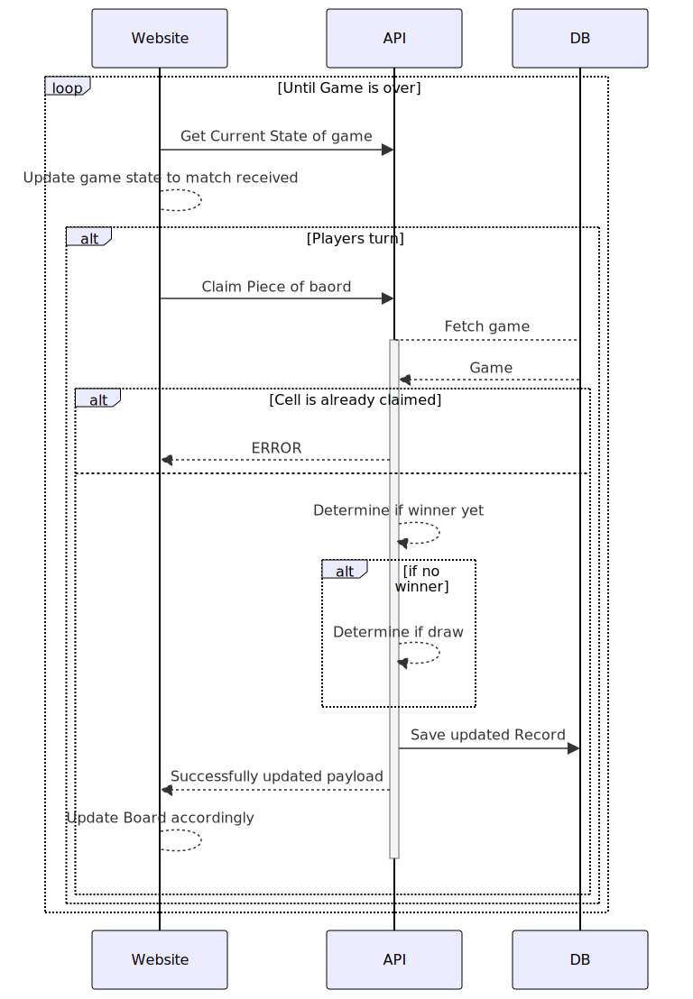

# tic tac toe

*Normally I would upload the PDF, but this will be a public repo, and I don't want to give away the question, or requirement*

## Scope
1. Single player game on ember js
2. Multiplayer, limited implementation using ruby
3. Multiplayer using websockets - Serious stretch goal

## Approach

Beacuse I still don't know ember and rails, I will not start off with testing, and rather looking for feedback in the API / output. Once I understand more about the frameworks I will retrospectively add more tests

## Documentation

### Create a new game

### Join an Existing Game

### Game loop

## Thoughts

### Night 1
Took me a good few hours to get my head around tracking of ember objects. 
Although I should have realised earlier that the proxy implementation they are using is very basic, likely for speed purposes.

*Created basic Single player experience on emberjs.*
Nothing fancy, no good shiny front end, still just learning the framework.

I understand what the tests are looking for, but with my 4 hours of experience with ember, I don't know if I quite know how to best setup my components for testing. 

### Night 2
the ruby server was pretty simple to put together, granted it's not doing much.
emberjs docs are hit and miss. Some of the docs are great, and understandable, while others require you to know ember to understand what is being explained. 

*Created basic run through of client / server game where 2 browsers can play at the same time*

I have still not gone back to the tests, because my basic architecture and design have morphed the more I understand the tools

### Night 3 && 4
I got caught in the reeds a little with looking into more ways to handle activities, like API calls, logging, decent code breakout. All of which I found some great options, however not reasonable to complete within the timeframe. All things I can use if I am to use the stack going forward

I am fairly certain in my very few hours I have worked with these tools, my code is both messy and falls into many anti patterns I'm not aware of yet.
